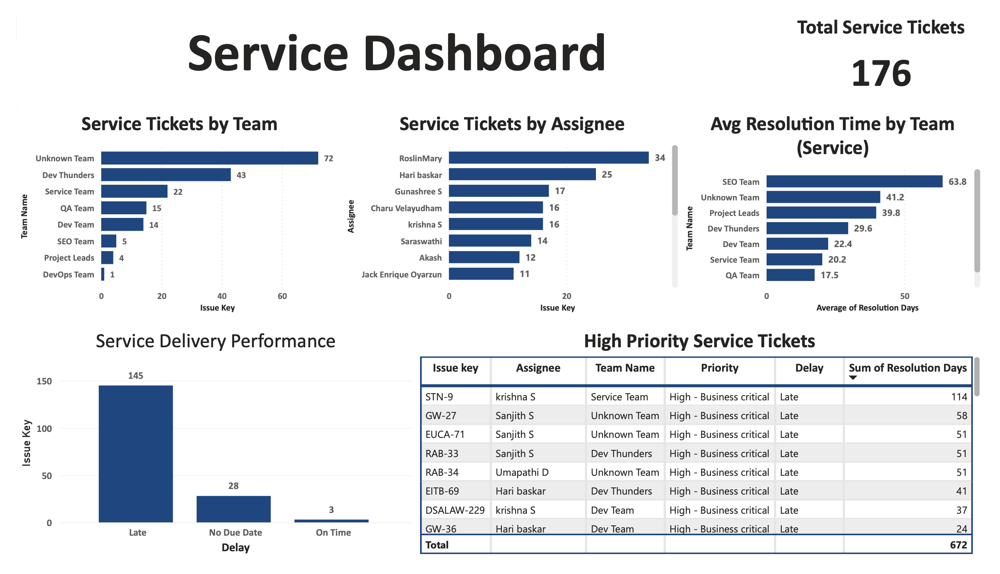
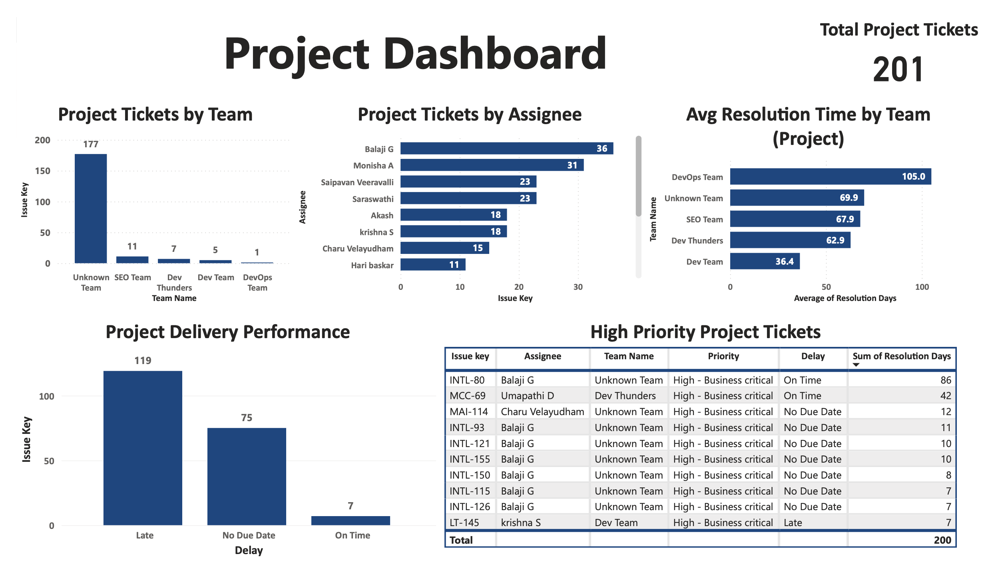

# Jira Performance Analysis | Power BI

## Overview
This project looks at Jira ticket data to understand delivery issues across teams.

The goal was simple:
- Find why tasks are getting delayed
- Check how work is distributed
- Identify gaps in planning and ownership

---

## What I Observed

- Most tickets are not completed on time
- A noticeable number of tasks don’t have due dates
- Work is concentrated on a few individuals
- “Unknown Team” appears in multiple records, which makes tracking ownership difficult

Service-related work is more delayed compared to project work.

---

## Key Numbers

- Total Tickets: 421
- Service Tickets: 176
- Project Tickets: 201

Delivery performance:
- Service tickets → heavily delayed
- Project tickets → moderate delay but still inconsistent

---

## Dashboard

### Service View

### Project View

---

## What Was Done

- Cleaned missing and incorrect values
- Created delay categories:
  - Late
  - On Time
  - No Due Date
- Calculated resolution time for each ticket
- Split analysis into Service and Project work
- Built dashboards in Power BI for tracking performance

---

## Key Issues Identified

1. Poor deadline management  
   Many tasks either miss deadlines or don’t have one

2. Lack of ownership  
   “Unknown Team” reduces accountability

3. Workload imbalance  
   Some individuals are handling a large share of tickets

4. Slow resolution in certain teams  
   Indicates inefficiency or overload

---

## Recommendations

- Make due dates mandatory for all tickets
- Assign clear team ownership
- Distribute workload more evenly
- Track delay metrics regularly
- Improve estimation accuracy based on past data

---

## Files Included

- Power BI dashboard (.pbix)
- Analysis report (PDF)
- Sample dataset (Excel)

---

## Note

The dataset used here is a sample and has been cleaned for analysis.
